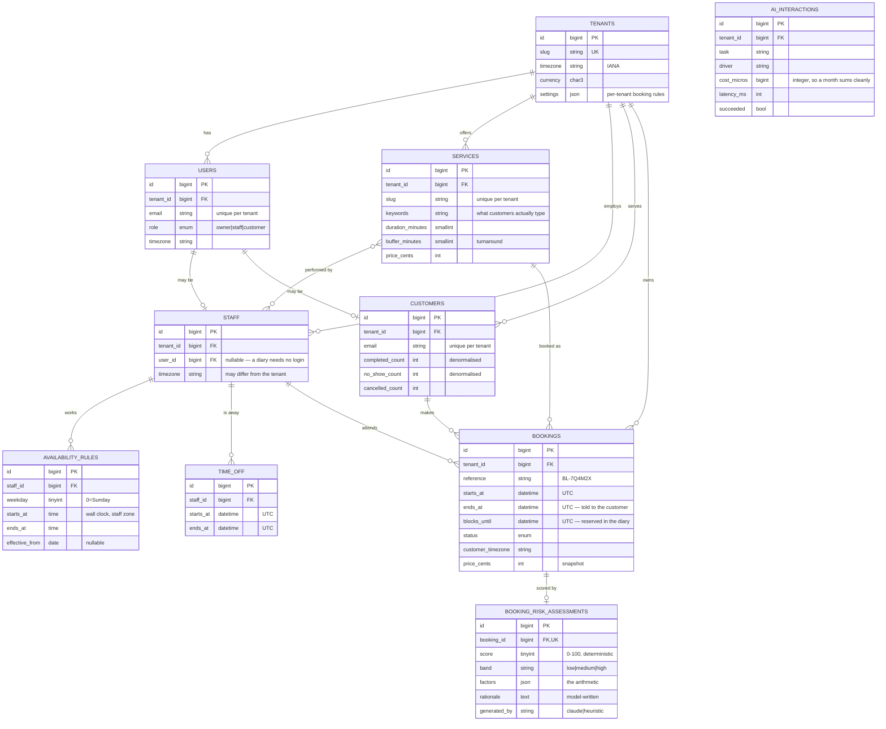

# Database

MySQL 8, thirteen migrations, eleven business tables. Every index in here exists for a query that is written down.

---

## ERD

```mermaid
erDiagram
    TENANTS ||--o{ USERS : "has"
    TENANTS ||--o{ SERVICES : "offers"
    TENANTS ||--o{ STAFF : "employs"
    TENANTS ||--o{ CUSTOMERS : "serves"
    TENANTS ||--o{ BOOKINGS : "owns"

    USERS ||--o| STAFF : "may be"
    USERS ||--o| CUSTOMERS : "may be"

    SERVICES }o--o{ STAFF : "performed by"

    STAFF ||--o{ AVAILABILITY_RULES : "works"
    STAFF ||--o{ TIME_OFF : "is away"
    STAFF ||--o{ BOOKINGS : "attends"

    SERVICES ||--o{ BOOKINGS : "booked as"
    CUSTOMERS ||--o{ BOOKINGS : "makes"

    BOOKINGS ||--o| BOOKING_RISK_ASSESSMENTS : "scored by"

    TENANTS {
        id bigint PK
        slug string UK
        timezone string "IANA"
        currency char3
        settings json "per-tenant booking rules"
    }
    USERS {
        id bigint PK
        tenant_id bigint FK
        email string "unique per tenant"
        role enum "owner|staff|customer"
        timezone string
    }
    SERVICES {
        id bigint PK
        tenant_id bigint FK
        slug string "unique per tenant"
        keywords string "what customers actually type"
        duration_minutes smallint
        buffer_minutes smallint "turnaround"
        price_cents int
    }
    STAFF {
        id bigint PK
        tenant_id bigint FK
        user_id bigint FK "nullable — a diary needs no login"
        timezone string "may differ from the tenant"
    }
    AVAILABILITY_RULES {
        id bigint PK
        staff_id bigint FK
        weekday tinyint "0=Sunday"
        starts_at time "wall clock, staff zone"
        ends_at time
        effective_from date "nullable"
    }
    TIME_OFF {
        id bigint PK
        staff_id bigint FK
        starts_at datetime "UTC"
        ends_at datetime "UTC"
    }
    CUSTOMERS {
        id bigint PK
        tenant_id bigint FK
        email string "unique per tenant"
        completed_count int "denormalised"
        no_show_count int "denormalised"
        cancelled_count int
    }
    BOOKINGS {
        id bigint PK
        tenant_id bigint FK
        reference string "BL-7Q4M2X"
        starts_at datetime "UTC"
        ends_at datetime "UTC — told to the customer"
        blocks_until datetime "UTC — reserved in the diary"
        status enum
        customer_timezone string
        price_cents int "snapshot"
    }
    BOOKING_RISK_ASSESSMENTS {
        id bigint PK
        booking_id bigint FK,UK
        score tinyint "0-100, deterministic"
        band string "low|medium|high"
        factors json "the arithmetic"
        rationale text "model-written"
        generated_by string "claude|heuristic"
    }
    AI_INTERACTIONS {
        id bigint PK
        tenant_id bigint FK
        task string
        driver string
        cost_micros bigint "integer, so a month sums cleanly"
        latency_ms int
        succeeded bool
    }
```

---
